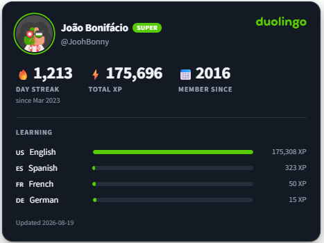

# quarto-duolingo

**Put your Duolingo streak on your Quarto site**

If you build your portfolio, CV or personal site with Quarto, this drops a card
with your streak, your XP and the languages you are learning right into the
page.



[Live demo](https://bonijoao.github.io/quarto-duolingo/)

## Installing

```bash
quarto add bonijoao/quarto-duolingo
```

## Using it

Set your username once, in `_quarto.yml` for the whole site or in a single
document's front matter:

```yaml
duolingo:
  user: your-username
```

Put the shortcode where the card belongs:

```

```

Any option can be passed inline, overriding the YAML:

```

```

If you study one language seriously and dabble in others, this is probably the
shape you want. The streak, the XP, and just your main course:

```yaml
duolingo:
  user: your-username
  courses: 1
  bars: false
```

## Options

| Option | Default | What it does |
|---|---|---|
| `user` | | **Required.** Your Duolingo username, the one in your profile URL. |
| `lang` | `en` | Labels and number formatting: `en`, `pt`, `es`, `fr`, `de`. |
| `theme` | `auto` | `auto` follows the reader's system setting and the Quarto dark toggle. `light` and `dark` pin it. |
| `accent` | `#58cc02` | Accent colour, applied to the wordmark, the avatar ring, the Super badge and the course bars. |
| `layout` | `card` | `card` is the full widget. `compact` is a slim one-liner for sidebars and footers. |
| `avatar` | `true` | Show your Duolingo avatar. |
| `stats` | `[streak, xp, since]` | Which tiles to show, in order. |
| `courses` | `4` | How many courses to list, biggest first. `0` hides the list. |
| `bars` | `true` | Draw each course's XP as a bar relative to your biggest one. Turn it off when you list a single course, where the bar is always full. |
| `link` | `true` | Make the card link to your Duolingo profile. |
| `on-error` | `warn` | `warn` logs a warning and omits the card. `fail` aborts the render with a non-zero exit code. |

Since every option lives in YAML, a bilingual page can render the same card
twice with different labels: `` in one tab and
`` in the other.

## How it works

The extension is a Lua filter registered as a Quarto shortcode. Everything
happens during `quarto render`, inside the Pandoc process.

**Fetching.** Duolingo exposes an unauthenticated profile endpoint at
`GET /2017-06-30/users?username=<user>`. The filter calls it with
`pandoc.mediabag.fetch` and parses the response with `quarto.json.decode`. Both
belong to the Lua API that Quarto ships, so the extension has no dependency
beyond Quarto itself.

That endpoint sends no `Access-Control-Allow-Origin` header, so a browser
refuses to read the response. Fetching at render time sidesteps the
restriction, since the request comes from the build machine.

**Emitting.** The filter builds the markup and returns it as a
`pandoc.RawBlock("html", ...)`. Text taken from the API is HTML-escaped before
interpolation. The stylesheet is attached with
`quarto.doc.add_html_dependency`, which loads it only on pages that use the
shortcode. The Duolingo wordmark is inlined as an SVG path coloured from CSS,
so it follows the `accent` option.

**Avatar.** The avatar URL returned by the API needs a size suffix (`/xlarge`).
The filter fetches the image and inlines it as a base64 `data:` URI, which
keeps the card working under `embed-resources: true` and leaves the published
page with no request to Duolingo's CDN.

**Other formats.** `quarto.doc.is_format("html:js")` gates the HTML path. For
PDF, DOCX and Markdown the filter returns native Pandoc blocks carrying the
same numbers as a sentence, so no raw HTML leaks into those outputs.

**Requests.** Profiles and avatars are memoised per Pandoc process, so a page
with several cards makes one request per username. Pages render in separate
processes, so the count is per page.

**Failures.** The fetch runs under `pcall`, and an empty `users` array counts as
a failure, since the endpoint answers `200` with `{"users": []}` for a username
that does not exist. Under the default `on-error: warn`, any failure logs a
warning and omits the card, leaving the rest of the page intact.

## Keeping it up to date

The numbers come from the moment the site was built. Nothing in the published
page updates on its own.

| How you publish | How often the card updates |
|---|---|
| `quarto publish gh-pages` from your machine | When you run it |
| A GitHub Action that renders on push | When you push |
| A GitHub Action with a `schedule` | As often as the schedule says |

To keep the card current, give your publishing workflow a schedule:

```yaml
name: Publish

on:
  push:
    branches: [main]
  schedule:
    # every day at 09:00 UTC, keeps the Duolingo card current
    - cron: "0 9 * * *"
  workflow_dispatch:

permissions:
  contents: write

jobs:
  build-deploy:
    runs-on: ubuntu-latest
    steps:
      - uses: actions/checkout@v4
      - uses: quarto-dev/quarto-actions/setup@v2
      - uses: quarto-dev/quarto-actions/publish@v2
        with:
          target: gh-pages
        env:
          GITHUB_TOKEN: ${{ secrets.GITHUB_TOKEN }}
```

Two things worth knowing about GitHub's scheduler: cron runs can be delayed by
several minutes, and schedules are disabled automatically after about 60 days
of repository inactivity, which `workflow_dispatch` lets you undo.

A weekly cron keeps the card reasonably current on a large site. If your
repository commits its rendered output, render only the page that holds the
card and commit that, which keeps the job fast and the diff small.

## Available data

The card can show everything the public endpoint returns:

| Field | Notes |
|---|---|
| Name, username, avatar | |
| Super status | rendered as a badge |
| Current streak | with the date it started |
| Total XP | |
| Courses | each course's XP, optionally drawn as bars |
| Member since | year the account was created |

### Not available

The public endpoint accepts a `fields` parameter that returns a field when it
exists and drops it silently when it does not, which makes it possible to
confirm what is missing:

- **Duolingo Score and CEFR level.** `score`, `cefrLevel`, `proficiency` and
  neighbouring names all come back empty. The Score is served by
  `score-api.duolingo.com`, which redirects away without a session.
- **Level, section and unit.** The `crowns` field is pinned at `9999` for every
  account and carries no progress information.
- **Longest streak.** Only the current streak is exposed.
- **XP history, league and division.** These require authentication and answer
  `401`.

## Notes

The endpoint is unofficial. It has been stable for years, though Duolingo makes
no promises about it and could change it without notice. The default
`on-error: warn` keeps that from breaking your build. If the API becomes
unavailable, you get a warning in the log and the page renders without the card.

The `user` option accepts any public username. Point it at accounts you have
reason to publish, since the card reproduces a person's name, avatar and daily
activity on your site.

Not affiliated with or endorsed by Duolingo, Inc. The Duolingo name and
logotype belong to them.
